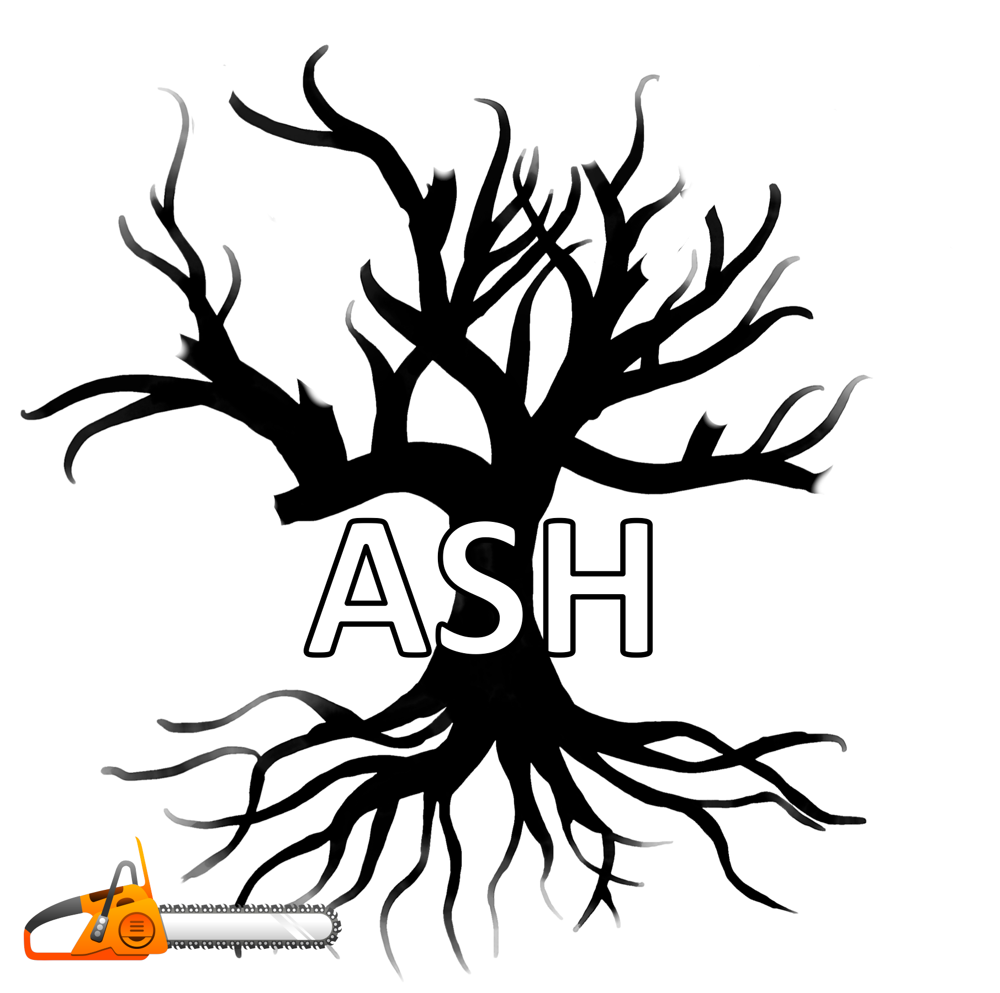

# ASH-lite: a computational chemistry environment

This is a strpped-down version of [ASH](https://github.com/lohedges/ash) for purposes of demonstrating ML/MM
molecular dynamics with electrostatic embedding. See
[ML/MM functionality](#mlmm-functionality) for details.

[ASH](https://github.com/lohedges/ash) is a Python-based computational chemistry and QM/MM environment, primarily
for molecular calculations in the gas phase, explicit solution, crystal or
protein environment. Can do single-point calculations, geometry optimizations,
surface scans, molecular dynamics, numerical frequencies etc. using a MM, QM
or QM/MM Hamiltonian.  Interfaces to popular QM codes: ORCA, xTB, Psi4,
PySCF, Dalton, CFour, MRCC.

## ML/MM functionality

To use ML/MM via the [interface_MLMM](interfaces/interface_MLMM.py) module, you'll need to install some
additional pacakges into your ASH Conda environment. A quick-and-dirty
environment setup can be performed as follows.

(The following assumes that you are in the ASH root directory. We advise
using a Python 3.9 MiniConda, available [here](https://repo.anaconda.com/miniconda/Miniconda3-py39_4.12.0-Linux-x86_64.sh).)

```sh
conda create ash-lite -c conda-forge pytorch-gpu torchani ipython jaxlib=\*=cuda\* jax openmm mdtraj
conda activate ash-lite
./conda_setup_ash.sh
```

(If you want to compare ML/MM predictions to those from ORCA, then make sure
that the `PATH` and `LD_LIBRARY_PATH` environment variables within the
`set_environment_ash.sh` script are updated to reflect your local
[ORCA](https://www.orcasoftware.de/tutorials_orca/) installation.)

For GPU functionality, you will need to install appropriate CUDA drivers on
your host system along with NVCC, the CUDA compiler driver. (This doesn't come
with `cudatoolkit` from `conda-forge`.)

Now install the additional, non-conda, [librascal](https://github.com/lab-cosmo/librascal) package, which is required for ML/MM
functionality. This requires access to C++ compiler and the [Eigen](https://www.google.com/search?client=firefox-b-d&q=eigen)
template library. We recommend installing these into your ASH environment
to ensure compatibility.

```sh
conda install -c conda-forge compilers eigen
git clone https://github.com/lab-cosmo/librascal.git
cd librascal
pip install .
```

An example showing ML/MM MD for alanine dipeptide can be found
[here](examples/mlmm_examples/mlmm_md.py).
